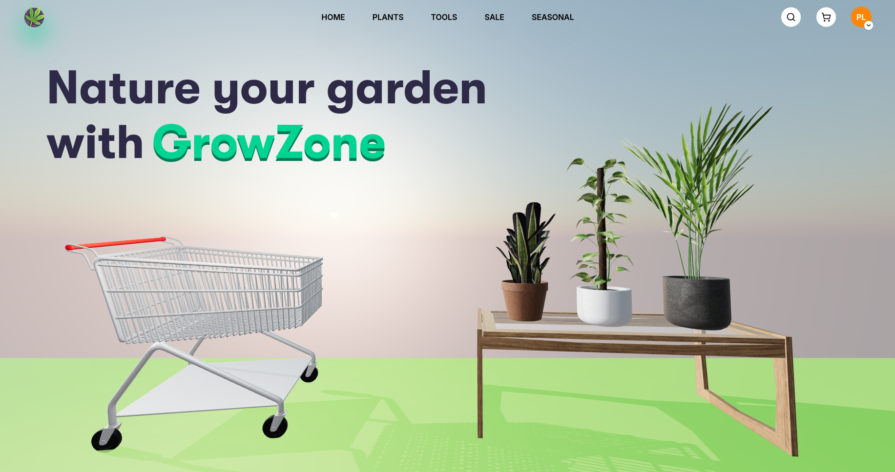

<div align="center">

# Grow Zone 

**GrowZone to nowoczesny sklep ogrodniczy online, stworzony z myślą o pasjonatach ogrodnictwa 🌱**

<br />

   

</div>



## Installation

### Open terminal

```bash

cd C:\xampp\htdocs
git clone https://github.com/barteks79/growzone

```

### Open PHPMyAdmin

```sql

CREATE DATABASE growzone COLLATE utf8mb4_polish_ci;
USE growzone;

-- import all content from database.sql
-- import all content from records.sql
```

### How to use

1. Turn on `Apache` & `MySQL` in `xampp-control-panel`

2. Open [http://localhost/growzone/pages/home](http://localhost/growzone/pages/home)
